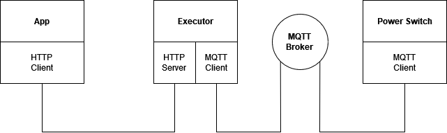

# Jarvis
[](https://www.gnu.org/licenses/gpl-3.0) [](https://github.com/mtribiere/Jarvis/actions/workflows/cmake.yml)<br>

## Description
A set of tools and protocols to automate your house<br>
For now, there is 3 main componants in this chain, the App, the executor, and the firmware.
<br><br>

<br><br>
  
## Compiling the Executor
The executor can be compiled with 2 modes, controled by the ```CONSOLE_BUILD``` variable at the top of <b><i>main.cpp</i></b>

| CONSOLE_BUILD | Executor |
| ------------- | ------------- |
| 1  | Disable the HTTP server and swap a terminal to debug manually devices  |
| 0  | Disable the console and enable the API/HTTP server  |

Before compiling, you need to install Boost, CrowCpp (If you enable API/HTTP), and Paho-MQTT.

```console
cd Jarvis/executor
mkdir build && cd build
cmake ..
make
./jarvis_executor
```

## Todo List
- [x] Custom firmware for the SOnOff switch
- [ ] Get ride of Arduino Core for the official ESP8266 SDK
- [ ] Basic API for direct commands
- [ ] Use a Intent Parser/NLP for the chat API (Mycroft adapt, Wit.ai,...)
- [x] Basic if-based Chat bot for Action
- [x] Switch to CMake
- [ ] Make a good UI for the App

Crafted with :heart: by mtribiere
